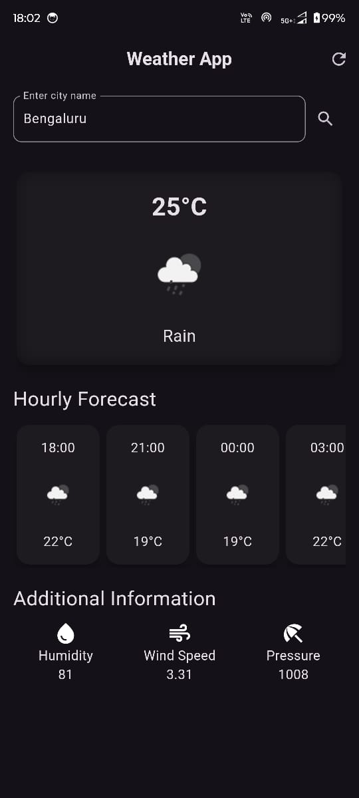

# Weather App

## Description

This is a simple weather app built using Flutter that allows users to get real-time weather forecasts for any location. Users can input their desired city, and the app will display the current weather conditions, hourly forecasts, and additional weather information.



## Features

- Real-time weather data fetching from OpenWeather API.
- User input for dynamic location searches.
- Environment variables for secure API key management.
- Intuitive and responsive UI with error handling for better user experience.

## Technologies Used

- Flutter
- Dart
- OpenWeather API
- dotenv package for environment variables

## Installation

1. Clone the repository:

   ```bash
   git clone https://github.com/yourusername/weather_app.git
   cd weather_app

   ```

2. Install dependencies:

   ```bash
   flutter pub get

   ```

3. Create a .env file in the root directory and add your OpenWeather API key:

   ```bash
   API_KEY=your_api_key_here

   ```

4. Run the app:

   ```bash
   flutter run
   ```

## Usage

- Open the app.
- Type the name of the city you want to check the weather for.
- The app will fetch and display the weather forecast, including temperature, humidity, wind speed, and more.

## Contributing

Contributions are welcome! If you find any issues or have suggestions for improvements, feel free to open an issue or submit a pull request.

## License

This project is licensed under the MIT License. See the LICENSE file for more details.

## Acknowledgements

- OpenWeather API for providing the weather data.
- Flutter for the powerful framework used to build this app.